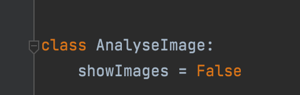

# Holty Tool - Optimalization Dewetting Aluminium
## Thesis - Lotte Boonstra

## Goal:
Minimalise the dewetting effects on thin Aluminum films through varying substrates and adhesion layers. 

### Secondary:
Quantifying these effects as a function of substrate material or adhesion layer material for a given thermal budget.

## Method:
Obtain images of the samples with the SEM or optical microscope and analyze the images with a python script to obtain the hole size and hole density. For the best results use one magnification (preferably 1.2k) and photograph the same film area. 

## Introduction Holty Tool
The Holty Tool is a newly created python-based image analyzing tool that can most importantly determine the average hole size and the hole density of SEM images. The product is a collaboration between Lotte Boonstra and ASRR B.V.

All the parameters that the Holty Tool can determine from an image are: the image path, the magnification, the image area, the pixel size, the number of holes, the total hole size in pixels and in nanometers, the average hole size in pixels and in nanometers and the hole density. 

The Holty Tool uses two streams of information to determine these parameters. Parameters like image area in pixels or number of holes are parameters the tool determines by analyzing the image via the script. Parameters like pixel size and magnification are parameters that are read out from the additional text file that is produced during imaging with the SEM. This text file contains all the information about the image. The script is able to read out this information. Parameters from these two streams of information are often combined to create a new parameter, like hole density.

An innovative feature of the tool is that it can recognise elements that have a faulty path name and create a properly structured path name. This helps with analyzing a large number of images. The images can just be uploaded into the tool and it will rename them properly. Now the images are ready to be analyzed. 

After renaming, the tool can analyze the images for the mentioned parameters. It also provides a visual per photo with the supposedly detected holes and the actual detected holes (this depends on the boundary conditions). After the tool showed all the visuals it provides graphs and tables on the visuals. 

This is a useful function if the images themselves need to be analyzed. However, a quicker option is provided to save time if there are many images to be analyzed (like 200+). Using this option, the tool will immediately provide the tables and graphs on the visuals. 

The graphs and tables are classified by type of bi-layer of a sample (for example Titanium-Prime). Within these classifications there are more tables providing information about a type of Bi-layer in combination with a type of substrate (for example Titanium-Prime as a Bi-layer in combination with Silicon substrate).

## Instalation Guide:
1. Install editor that supports python (for example Pycharm)
2. Clone the repository using this guide: https://docs.github.com/en/repositories/creating-and-managing-repositories/cloning-a-repository
3. Difficulties with cloning the repository?  Use this guide for troubleshouting during cloning: https://docs.github.com/en/repositories/creating-and-managing-repositories/troubleshooting-cloning-errors
4. Install used packages (install the newest version unless this gives rise to any problems)

## Photo uploading process
1. Use correct naming: substrate_bilayer_temperature_index. For diversion within a substrate use a regular dash: substrate-variation-one_bilayer_temperature_index. Note: Use RT for room temperature.
2. The Holty Tool includes a method, SanitizeInput.py. This method corrects incorrect naming and puts it in the (in point 1) described correct naming. The minimum requirements for this method to work is including substrate, bilayer and temperature. Note: This method is limited to the substrate, bilayers and temperatures within the scope of this research. However, it can be adjusted to the desired substrate, bilayers and temperatures. 
3. It also provides a visual per photo with the supposedly detected holes and the actual detected holes (this depends on the boundary conditions). After showing all the visuals the tool provides graphs and tables on the visuals. Note: A quicker option is provided to save time if there are many images to be analyzed (like 200+). Using this option, the tool will immediately provide the tables and graphs on the visuals. When showImages = False the tool only shows the data and skips the visuals. See figure below. 

## Tips and tricks 
* When showImages = False the tool only shows the data and skips the visuals. 
* The tool determines the best fit pixel boundary conditions based on the magnification of the image. 
* Run SanitizeInput.py to sanitize the input into correct naming. 
* The tool crops image, because there is often noise on the outer edge causing disturbances in the data. 
* The output is presented in concise and well-organised graphs and tables.

## Scope and limitations
* The scope of the tool is the described combinations of substrates, bilayers and temperatures. However, this can be altered to the desired combinations. 

### Versions

| **Package**     	| **Version** 	|
|-----------------	|-------------	|
| curve-fit       	| 0.0.5       	|
| cycler          	| 0.11.0      	|
| fonttools       	| 4.29.1      	|
| kiwisolver      	| 1.3.2       	|
| matplotlib      	| 3.5.1       	|
| numpy           	| 1.21.4      	|
| opencv-python   	| 4.5.4.58    	|
| packaging       	| 21.3        	|
| pandas          	| 1.4.0       	|
| patsy           	| 0.5.2       	|
| Pillow          	| 9.0.1       	|
| pip             	| 21.3.1      	|
| pyparsing       	| 3.0.7       	|
| python-dateutil 	| 2.8.2       	|
| pytz            	| 2021.3      	|
| scipy           	| 1.7.3       	|
| setuptools      	| 57.0.0      	|
| six             	| 1.16.0      	|
| statsmodels     	| 0.13.1      	|
| wheel           	| 0.36.2      	|

## Resources
1. https://www.pyimagesearch.com/2021/05/12/opencv-edge-detection-cv2-canny/
2. https://docs.opencv.org/3.4/da/d22/tutorial_py_canny.html
3. https://stackoverflow.com/questions/64394768/how-calculate-the-area-of-irregular-object-in-an-image-opencv-python-3-8