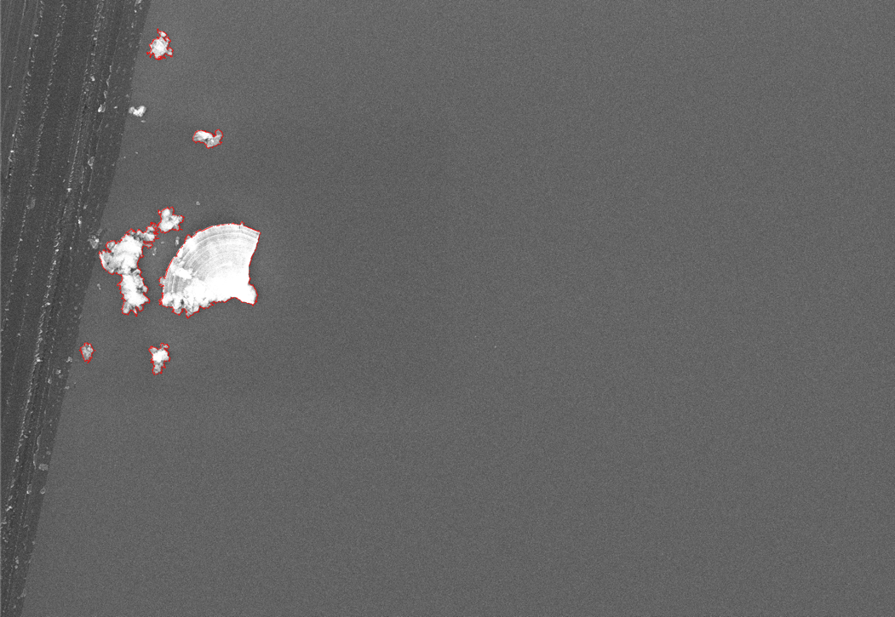

# Optimalization Dewetting Aluminium
## BEP - Lotte Boonstra

## Goal:
Analyse dewetting results for improvements

## Checklist
- [x] Blur image
- [x] Find contours

## Resources
1. https://www.pyimagesearch.com/2021/05/12/opencv-edge-detection-cv2-canny/
2. https://docs.opencv.org/3.4/da/d22/tutorial_py_canny.html
3. https://stackoverflow.com/questions/64394768/how-calculate-the-area-of-irregular-object-in-an-image-opencv-python-3-8